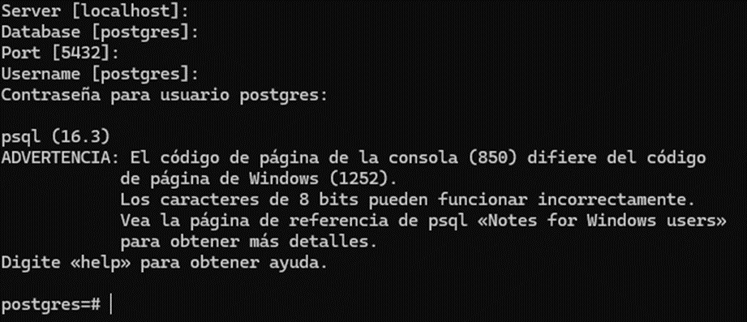

En primer lugar, accedemos a la Shell de PostgreSQL:



Luego ejecutarémos el siguiente comando:
```bash
CREATE DATABASE nombredb;
```
Luego es recomendable crear el usuario que tendrá acceso a dicha base de datos:
```bash
CREATE USER nombreuser;
```
Luego de crear el usuario debemos acceder a la base de datos y darle permisos al usuario que acabamos de crear sobre la misma:
```bash
\c nombredb
ALTER ROLE nombreuser WITH PASSWORD ‘password’;
```
Con estos simples pasos ya se ha creado la base de datos y hemos asignado un usuario a la misma, solo con esta configuración podemos realizar nuestras migraciones en django.

***Observación: no olvides los “;” al final de cada comando***

## Eliminar Base de Datos

En caso que necesitemos eliminar nuestra base de datos debemos acceder de igual manera a la **Shell de PostgreSQL** y ejecutar el siguiente comando:
```bash
DROP DATABASE nombredb;
```
Solo así ya habremos eliminado nuestra Base de Datos.
